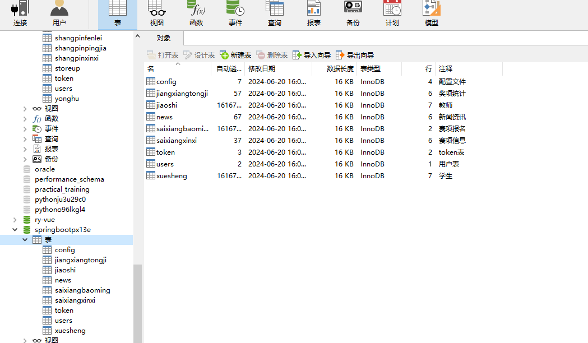
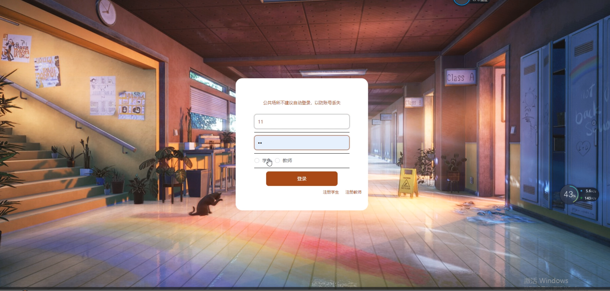

# 基于springboot的学科竞赛管理

<h4 style='color:red'>联系不到我，就看我的主页 </h4> 
 
#### 介绍

基于Springboot的学科竞赛管理系统是一款专为学科竞赛活动设计的综合管理平台，旨在提高竞赛组织和参与的效率。该系统分为管理端、教师端和学生端，每个角色均提供了丰富的功能模块，以满足不同用户的需求和职责。

#### 技术栈

后端技术栈：Springboot+Mysql+Maven

前端技术栈：Vue+Html+Css+Javascript+ElementUI

开发工具：Idea+Vscode+Navicate

#### 系统功能介绍

管理端功能模块

个人中心：管理员可以在个人中心查看和编辑个人信息，包括修改密码和更新联系方式。

学生管理：管理员可以管理学生信息，包括新增、修改和删除学生，确保学生数据的准确性。

教师管理：管理员可以管理教师信息，包括新增、修改和删除教师，确保教师数据的准确性。

赛项信息管理：管理员可以管理竞赛项目信息，包括新增、修改和删除赛项，确保信息的完整性和准确性。

赛项报名管理：管理员可以管理学生和教师的赛项报名信息，审核报名申请，确保报名过程的顺利进行。

奖项统计管理：管理员可以统计和管理竞赛的获奖信息，生成获奖统计报告。

管理品管理：管理员可以管理竞赛相关的物品和资源，确保物品的合理分配和使用。

系统管理：包括系统设置、权限管理等，确保系统的稳定运行和安全性。

教师端功能模块

赛项信息：教师可以浏览和查看竞赛项目信息，了解竞赛的具体内容和要求。

新闻资讯：教师可以查看与竞赛相关的新闻资讯，获取最新的竞赛动态和公告。

个人中心：教师可以在个人中心查看和编辑个人信息，包括修改密码和更新联系方式。

后台管理：

赛项报名管理：教师可以管理自己和学生的赛项报名信息，提交报名申请，查看报名状态。

学生端功能模块

赛项信息：学生可以浏览和查看竞赛项目信息，了解竞赛的具体内容和要求。

新闻资讯：学生可以查看与竞赛相关的新闻资讯，获取最新的竞赛动态和公告。

个人中心：学生可以在个人中心查看和编辑个人信息，包括修改密码和更新联系方式。

后台管理：

赛项报名管理：学生可以管理自己的赛项报名信息，提交报名申请，查看报名状态。

#### 系统作用

对管理员的作用

高效管理：系统提供了丰富的管理工具，帮助管理员高效地管理学生、教师和竞赛信息，确保管理工作的高效性和准确性。

信息传达：通过赛项信息和新闻资讯模块，管理员可以及时发布重要信息和动态，确保信息传递的及时性。

报名和奖项管理：系统帮助管理员高效管理赛项报名和奖项统计，确保竞赛活动的顺利进行。

对教师的作用

竞赛参与：教师可以方便地查看和参与竞赛项目信息，提交和管理报名申请，提升参与度。

信息获取：通过新闻资讯模块，教师可以及时获取竞赛相关的最新动态和公告。

个人管理：教师可以通过个人中心管理和更新个人信息，确保信息的准确性。

对学生的作用

竞赛参与：学生可以方便地查看和参与竞赛项目信息，提交和管理报名申请，提升参与度。

信息获取：通过新闻资讯模块，学生可以及时获取竞赛相关的最新动态和公告。

个人管理：学生可以通过个人中心管理和更新个人信息，确保信息的准确性。

#### 系统功能截图

代码结构

数据库表

登录

首页

赛事信息

个人中心

后台管理

管理端信息

赛事报名管理

#### 总结

基于Springboot的学科竞赛管理系统通过角色分工和功能模块的设计，实现了对学科竞赛活动的高效管理和参与。管理员可以通过系统高效地管理竞赛相关信息，确保竞赛活动的顺利进行；教师和学生则可以方便地参与竞赛，获取最新资讯，提高参与度和满意度。该系统不仅提高了竞赛管理的效率和安全性，也为竞赛活动的组织和参与提供了有力的支持。

#### 使用说明

创建数据库，执行数据库脚本 修改jdbc数据库连接参数 下载安装maven依赖jar 启动idea中的springboot项目

后台地址：http://localhost:8080/springbootpx13e/admin/dist/index.html

管理员  abo 密码 abo

前台地址：http://localhost:8080/springbootpx13e/front/index.html

